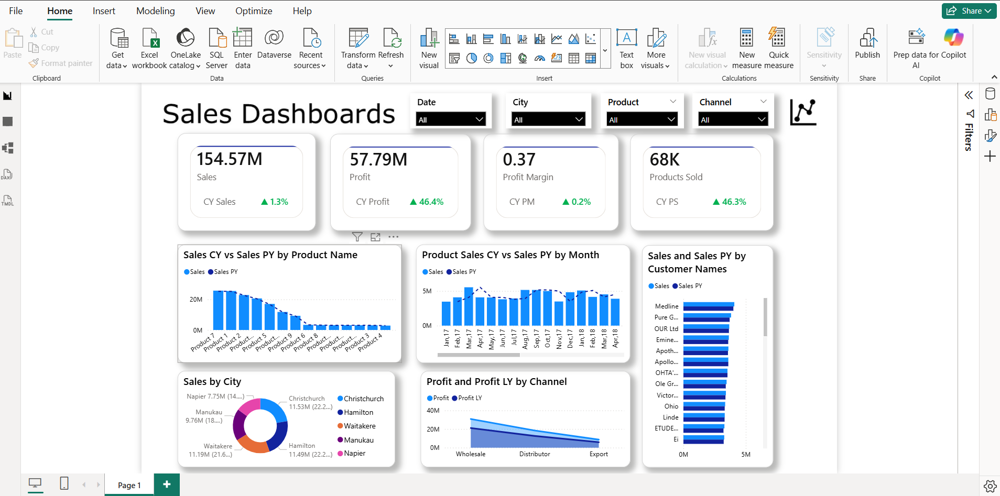

# 💰 Revenue Intelligence Dashboard

---

## 🚀 Transforming Data into Strategic Business Insights

An **executive-level Revenue Intelligence Dashboard** built using Microsoft Power BI, designed to deliver actionable insights, performance tracking, and data-driven decision support.  

This project demonstrates the ability to convert raw sales data into a **high-impact, interactive dashboard** that enables stakeholders to monitor revenue, analyze trends, and optimize business performance.

---

## 🖼 Dashboard Preview

  

  <em>Global wealth distribution, industry trends, and regional insights</em>

---

## 🧩 Project Overview

The **Revenue Intelligence Dashboard** provides a 360° view of business performance by integrating key revenue metrics, customer insights, and product analytics into a single, intuitive interface.

It empowers decision-makers to:

- Track revenue and profitability in real time  
- Identify top-performing products and customers  
- Analyze regional and channel performance  
- Make informed, data-driven business decisions  

---

## 🎯 Key Metrics Snapshot

| Metric            | Value   |
|------------------|--------|
| 💰 Total Revenue | 154.57M |
| 📈 Total Profit  | 57.79M  |
| 📊 Profit Margin | 0.37    |
| 📦 Quantity Sold | 68K     |

---

## 📊 Dashboard Capabilities

✔ **Revenue & Profit Analysis** – Monitor financial performance with dynamic KPIs  
✔ **Time Intelligence** – Monthly trend analysis with Year-over-Year comparison (CY vs PY)  
✔ **Product Performance** – Identify high-performing and underperforming products  
✔ **Customer Insights** – Analyze top customers and revenue contribution  
✔ **Regional Analysis** – Evaluate sales distribution across cities  
✔ **Channel Performance** – Compare Wholesale, Distributor, and Export channels  

---

## 📈 Key Business Insights

### 💰 Revenue & Profitability
- Consistent growth observed across key revenue metrics  
- High-margin products significantly influence profitability  

### 📅 Trend Analysis
- Clear monthly sales patterns enabling better forecasting  
- Identification of seasonal demand fluctuations  

### 🌍 Regional Performance
- Revenue concentration in key cities  
- Opportunities for expansion in underperforming regions  

### 👥 Customer Intelligence
- A small segment of customers drives a large share of revenue  
- Potential for targeted customer engagement strategies  

### 📦 Channel Effectiveness
- Wholesale and Distributor channels dominate revenue  
- Export channel presents future growth opportunities  

---

## 🛠 Tools & Technologies

- Microsoft Power BI – Dashboard Development & Visualization  
- DAX (Data Analysis Expressions) – Advanced Calculations  
- Data Modeling – Relationship Building & Optimization  
- Power Query – Data Cleaning & Transformation  
- Microsoft Excel – Data Source & Preprocessing  
- Git & GitHub – Version Control & Project Management  

---

## 📁 Dataset Details

**Source File:** `sales-data.xlsx`

**Key Attributes:**
- Product Name  
- Sales Amount  
- Profit  
- Customer Name  
- City  
- Sales Channel  
- Order Date  

---

## 💼 Business Value

This dashboard delivers measurable value by:

✔ Enabling real-time performance monitoring  
✔ Supporting strategic decision-making  
✔ Identifying revenue growth opportunities  
✔ Improving operational efficiency  
✔ Enhancing data-driven culture within organizations  

---

## 🧠 Skills Demonstrated

- Data Cleaning & Transformation  
- Data Modeling & DAX  
- Exploratory Data Analysis (EDA)  
- Data Visualization & Storytelling  
- Business Insight Generation  
- Dashboard Design (UI/UX Best Practices)  
- Analytical & Critical Thinking  

---

## 🚀 Future Enhancements

- 🔮 Predictive analytics for revenue forecasting  
- 🌐 Integration with real-time data sources  
- 📊 Advanced drill-through and interactivity  
- 👥 Customer segmentation & cohort analysis  
- ☁ Deployment via Power BI Service  

---
________________________________________
## 📂 Project Structure

| File/Folder | Description |
|------------|------------|
| revenue-intelligence-dashboard.pbix | Power BI Dashboard |
| sales-data.xlsx | Dataset |
| README.md | Project documentation |
| images/dashboard-preview.png | Dashboard screenshot |

---
________________________________________
## 👨‍💻 Author

**Aravind Kumar R**  
*Data Analyst | Power BI Developer*  

📊 Passionate about transforming data into actionable insights  
📈 Skilled in Power BI, DAX, and Business Intelligence  
🚀 Focused on solving real-world business problems using data  

---

🔗 **GitHub**: https://github.com/Aravind-Kumar-27  
🔗 **LinkedIn**: [Aravind Kumar](https://linkedin.com/in/r-aravind-kumar)  
📧 **Email**: r.aravindkumar27@gmail.com  
________________________________________
⭐ If you found this project useful
Give it a ⭐ on GitHub and feel free to connect!
________________________________________
